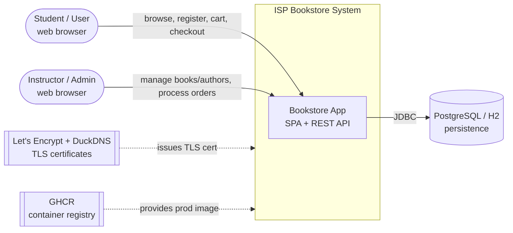
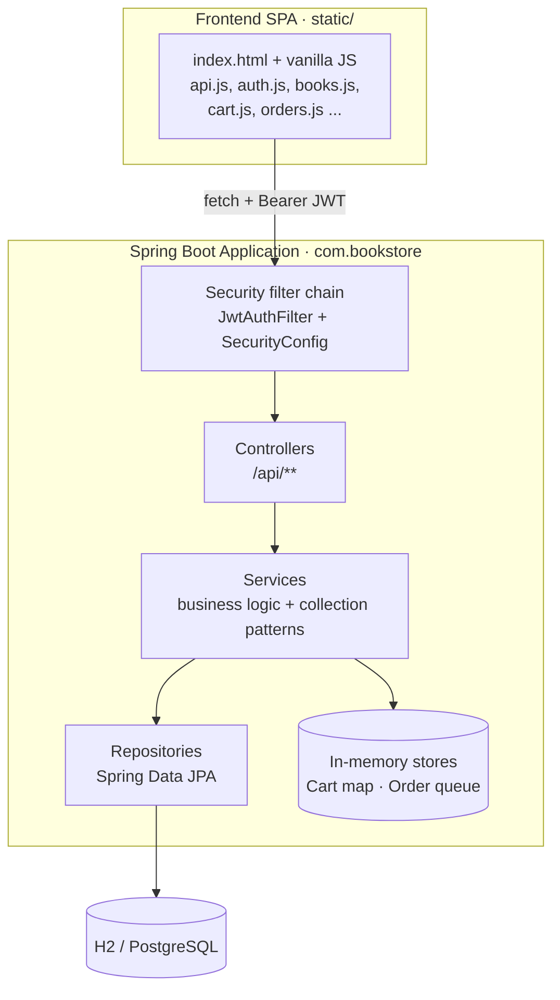
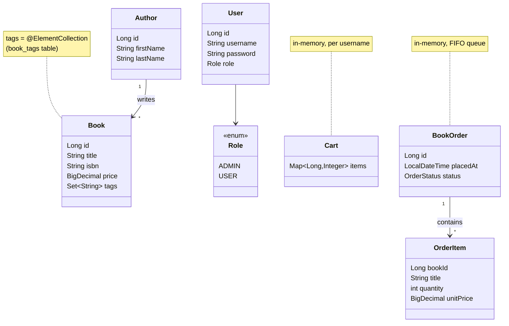
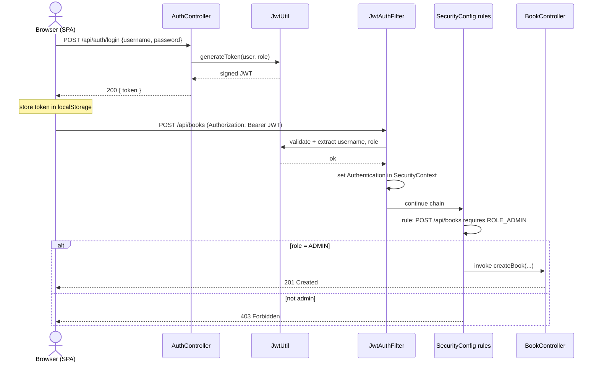
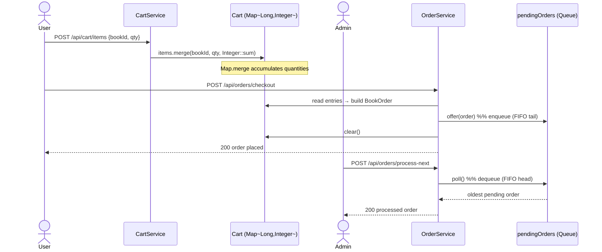
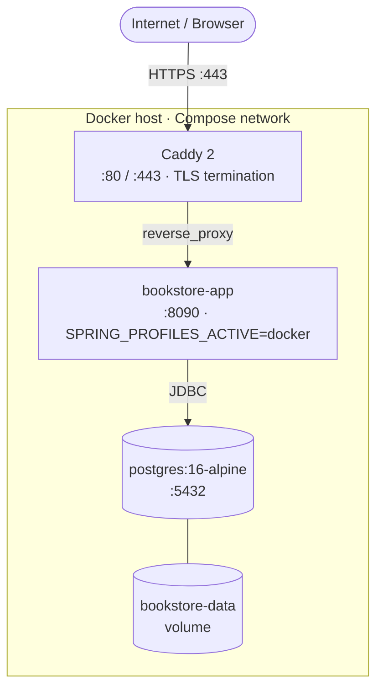

# Architecture — ISP Bookstore 2026 (arc42)

> **What this is.** A worked example of documenting a real system with the
> [arc42](https://arc42.org) method. It is intentionally a **condensed demo**: it
> fills the highest-value arc42 chapters (1, 3, 4, 5, 6, 7, 9) and keeps the
> official numbering so the structure stays recognizable. Chapters **2 (Constraints)**,
> **10 (Quality Scenarios)** and **11 (Risks & Technical Debt)** are omitted for
> brevity — in a full document you would fill those too.
>
> Diagrams use [Mermaid](https://mermaid.js.org) and render natively on GitHub.
> For deeper detail see [DEVELOPER-GUIDE.md](DEVELOPER-GUIDE.md) and
> [COLLECTIONS-GUIDE.md](COLLECTIONS-GUIDE.md).

---

## 1. Introduction and Goals

The **ISP Bookstore** is the reference application for the *Software Engineering
(ISP) 2026* course at UTCN. Its primary purpose is to teach the **Java Collections
Framework** (Set, Map, Queue, List) inside a realistic Spring Boot 3.4.3 / Java 17
application: JWT-secured REST API, H2 (dev) / PostgreSQL (prod) persistence, and a
vanilla-JS single-page frontend. The service layer is deliberately shaped to
showcase specific collection patterns — clarity for students wins over production
optimization.

### Quality goals

| # | Quality goal | Why it matters here |
|---|--------------|---------------------|
| 1 | **Teachability / understandability** | The code is a teaching artifact. The layering and service shapes must be obvious and exemplary. This is the dominant driver. |
| 2 | **Security correctness** | Demonstrates stateless JWT auth and clean ADMIN/USER role separation that students can reason about. |
| 3 | **Portability** | Same code runs on in-memory H2 (dev) and PostgreSQL (prod) via Spring profiles — shows environment-independent design. |
| 4 | **Operational simplicity** | One command to run locally; one `docker compose` to deploy with TLS. Low friction for students and instructors. |

### Stakeholders

| Stakeholder | Concern |
|-------------|---------|
| **Students** | Read the code as a model of layered design and collection usage. |
| **Instructor** | Demo features live; explain design decisions; reuse for assignments. |
| **Maintainers** | Extend endpoints/features without breaking the teaching patterns. |

---

## 3. Context and Scope

### Business / system context

### Technical context — external interfaces

| Interface | Direction | Protocol / detail |
|-----------|-----------|-------------------|
| Web UI + REST API | inbound | HTTPS `:443` (Caddy) → app `:8090`; REST under `/api/**`, JSON |
| Authentication | inbound | `Authorization: Bearer <JWT>` (HMAC-SHA256, 1 h expiry) |
| Database | outbound | JDBC — PostgreSQL (prod) / in-memory H2 (dev) |
| TLS issuance | outbound | ACME HTTP-01 via Caddy (Let's Encrypt, DuckDNS domain) |
| Image registry | outbound (deploy) | Pull prod image from `ghcr.io/automatica-cluj/isp-bookstore-2026-complete` |

---

## 4. Solution Strategy

| Quality goal | Architectural approach |
|--------------|------------------------|
| Teachability | Classic **layered Spring MVC**: controller → service → repository. Service methods are written to *demonstrate* one collection pattern each. |
| Teachability | **Cart / Order kept in JVM memory** (POJOs, not JPA) so `Map`, `Queue` and `List` usage is front-and-center, unobscured by persistence. |
| Security | **Stateless JWT** with a single `JwtAuthFilter`; route rules centralized in `SecurityConfig`; roles `ADMIN` / `USER`. |
| Portability | **Spring profile split**: default profile = H2 + `create-drop` + seed data; `docker` profile = PostgreSQL + `ddl-auto: update`, no seed. |
| Operational simplicity | **Caddy reverse proxy** terminates TLS and proxies to the app; **Docker Compose** wires app + Postgres + Caddy. |
| Maintainability | **Trunk-based CI/CD** with `semantic-release` driven by Conventional-Commit PR titles; multi-arch image published to GHCR. |

---

## 5. Building Block View

### Level 1 — System overview

### Level 2 — Application building blocks (whitebox)

Base package: `com.bookstore`.

| Package | Building block | Responsibility |
|---------|----------------|----------------|
| `controller/` | `AuthController` | `POST /api/auth/register`, `/login` — issue JWT (public). |
| | `BookController` | Book CRUD + `GET /api/books/tags`, `/by-author` (reads/writes via `BookService`). |
| | `AuthorController` | Author list/get (public) + create (admin). |
| | `CartController` | Add / list / remove / clear cart (authenticated). |
| | `OrderController` | `checkout` (auth), `pending` & `process-next` (admin, FIFO). |
| | `StatisticsController` | Aggregate counts + health (authenticated by default rule). |
| | `VersionController` | `GET /api/version` — app version (public). |
| | `GlobalExceptionHandler` | `@RestControllerAdvice` → consistent error responses. |
| `service/` | `BookService` | CRUD; **`getAllTags()`** = `HashSet` dedup; **`getBooksByAuthor()`** = `Collectors.groupingBy()` → `Map<String, List<BookResponse>>`. |
| | `CartService` | `Map<String, Cart>` (username → cart) with **`computeIfAbsent`** lazy init. |
| | `OrderService` | `Queue<BookOrder>` backed by `LinkedList`; **`offer()` / `poll()`** (FIFO). |
| | `AuthorService` | Author CRUD; stream → DTO mapping. |
| `repository/` | `User`/`Book`/`AuthorRepository` | Spring Data JPA interfaces over H2 / PostgreSQL. |
| `security/` | `SecurityConfig` | Filter chain, route authorization, stateless session, `BCryptPasswordEncoder`. |
| | `JwtUtil` | Generate / parse / validate JWT (JJWT 0.12.6, HMAC-SHA256). |
| | `JwtAuthFilter` | `OncePerRequestFilter` — extract Bearer token, populate `SecurityContext`. |
| | `CustomUserDetailsService` | Load `UserDetails` from `UserRepository`. |
| `config/` | `WebConfig` | CORS origins (`localhost`, `*.duckdns.org`). |
| `model/` | `User`, `Author`, `Book` | **JPA entities** (persisted). |
| | `Cart`, `BookOrder`, `OrderItem` | **In-memory POJOs** (reset on restart). |

> **Route authorization** is centralized in `SecurityConfig.securityFilterChain`:
> `GET /api/books/**`, `/api/authors/**`, `/api/version`, `/api/auth/**` are public;
> book/author writes and `orders/pending`+`process-next` require `ADMIN`;
> `/api/cart/**` and `orders/checkout` require authentication; everything else
> defaults to authenticated.

### Domain model

JPA-persisted: `User`, `Author`, `Book` (+ `book_tags`). In-memory only: `Cart`,
`BookOrder`, `OrderItem`.

---

## 6. Runtime View

### 6.1 Authentication and an authorized (admin) request

### 6.2 Cart → checkout → FIFO order processing

---

## 7. Deployment View

| Aspect | Dev (`compose.dev.yml`) | Prod (`compose.prod.yml`) |
|--------|--------------------------|----------------------------|
| App image | Built locally from `Dockerfile` (JDK build stage) | Pulled from GHCR, built via `Dockerfile.runtime` |
| Database | PostgreSQL 16 (compose) — or H2 when run via `mvn spring-boot:run` | PostgreSQL 16 (compose) |
| Schema | `ddl-auto: update` (Postgres) / `create-drop` + seed (H2 default profile) | `ddl-auto: update`, no seed data |
| TLS / domain | `SITE_ADDRESS=localhost` → self-signed cert | `SITE_ADDRESS=.duckdns.org` → Let's Encrypt |
| Config source | hard-coded compose values | env vars (`POSTGRES_*`, `APP_IMAGE`, `SITE_ADDRESS`) |

The app container listens on **8090** internally (also `EXPOSE 8080` in the
Dockerfile is unused under compose); only Caddy publishes `:80`/`:443`. Caddy data
and Postgres data are persisted in named volumes.

---

## 8. Crosscutting Concepts (brief)

- **Authentication & authorization** — one stateless `JwtAuthFilter` + centralized
  `SecurityConfig` rules; passwords hashed with BCrypt; roles `ADMIN` / `USER`.
- **CORS** — `WebConfig` allows `http(s)://localhost:*` and `https://*.duckdns.org`.
- **Error handling** — `GlobalExceptionHandler` (`@RestControllerAdvice`) maps
  exceptions to consistent JSON; `server.error.include-message: always` in dev.
- **Validation** — Jakarta Bean Validation on request DTOs.
- **Collections as a teaching concern** — Set/Map/Queue/List patterns deliberately
  spread across the service layer (see [COLLECTIONS-GUIDE.md](COLLECTIONS-GUIDE.md)).

---

## 9. Architecture Decisions

Deliberate, non-obvious choices (do not "fix" these without being asked):

| Decision | Rationale |
|----------|-----------|
| **First registered user becomes ADMIN**, all others USER | Zero-config bootstrap of an admin for demos; a course shortcut, not production design. |
| **Stateless JWT; CSRF disabled** | Pure token auth per request — no server session; CSRF protection is unnecessary for a stateless bearer-token API. |
| **Cart / BookOrder / OrderItem in JVM memory only** | Keeps `Map.merge`, `computeIfAbsent`, and `Queue` FIFO front-and-center; data resets on restart by design. |
| **Profile split H2 (dev) / PostgreSQL (prod)** | Friction-free local runs vs. realistic persistence; seed `data.sql` is dev-profile only. |
| **Committed dev JWT secret** | Convenient for the course; must be overridden via env/config for any real deployment. |
| **Trunk-based single branch + semantic-release** | `main` only; PR title (Conventional Commits) drives the version bump. `CHANGELOG.md` and the `pom.xml` version are machine-written — never hand-edit. |

---

## 12. Glossary

| Term | Meaning |
|------|---------|
| **SPA** | Single-page application — the vanilla-JS frontend in `static/`. |
| **JWT** | JSON Web Token; signed bearer token (HMAC-SHA256) carrying username + role. |
| **ADMIN / USER** | The two roles; ADMIN may manage catalog and process orders. |
| **`ddl-auto`** | Hibernate schema strategy: `create-drop` (dev H2) vs `update` (prod). |
| **ACME / DuckDNS** | Protocol/domain provider Caddy uses to obtain Let's Encrypt TLS certs. |
| **GHCR** | GitHub Container Registry — hosts the published production image. |
| **semantic-release** | Automation that versions, tags, and changelogs from commit messages. |

---

## Further reading

- [DEVELOPER-GUIDE.md](DEVELOPER-GUIDE.md) — full architecture & API reference
- [COLLECTIONS-GUIDE.md](COLLECTIONS-GUIDE.md) — the Collections Framework patterns in depth
- [HTTPS_Setup.md](HTTPS_Setup.md) — Caddy + DuckDNS + Let's Encrypt
- [RELEASE-WALKTHROUGH.md](RELEASE-WALKTHROUGH.md) — the semantic-release flow
